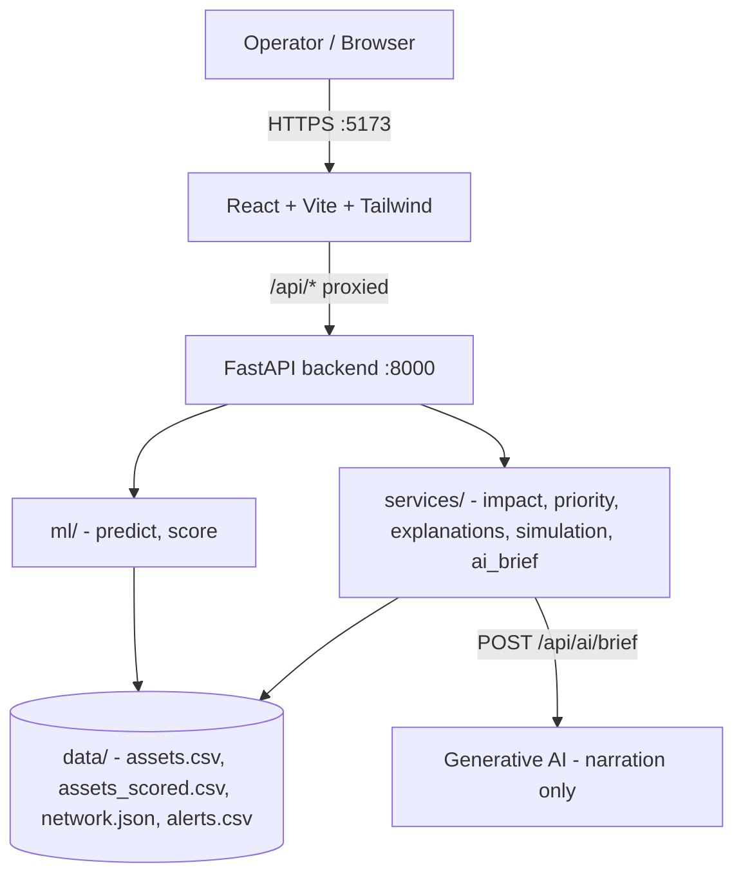

# Architecture

## System Architecture

GridGuardian AI is a three-layer web application: a React SPA, a FastAPI REST
backend, and a set of tested service modules over a deterministic synthetic dataset.



## Components

| Component | Technology | Responsibility |
|---|---|---|
| Frontend | React 18 + Vite 5 + Tailwind CSS + Recharts | Operations console: overview, assets, detail, what-if, priority, alerts, AI brief, model pages |
| Backend API | FastAPI 0.115 + uvicorn | Thin REST adapters over tested services; error contract (400/404/422/500) |
| ML | scikit-learn Gradient Boosting | Predict per-asset failure probability and risk categories |
| Simulation | NetworkX (deterministic graph cascade) | What-If failure scenarios over grid topology |
| Prioritization | Transparent scoring formula | Rank assets and allocate crews (greedy) |
| AI Brief | `anthropic` SDK (generative AI) | Narrate structured backend metrics; never calculates numbers |

## Module Layout

```
src/backend/app/            src/frontend/src/
  api/           routers      components/   design system, charts, topology, layout
  ml/            train/score/predict/index  pages/       8 pages
  services/      impact, priority, sim, ... services/    api.js client (17 endpoints)
  main.py        FastAPI entrypoint         lib/         formatting + UI tokens
src/backend/data/            deterministic synthetic dataset (seed 42)
```

## Data Flow

1. `backend/data/generate_data.py` creates ~800 synthetic assets plus alerts and
   `network.json` (seed = 42, deterministic).
2. `ml/train.py` trains a Gradient Boosting model; `ml/score.py` produces
   `assets_scored.csv` with failure probability and risk category.
3. `services/score_priority.py` combines risk, grid impact, criticality, and urgency
   into `assets_prioritized.csv` (maintenance priority ranking).
4. The FastAPI `registry` loads the precomputed CSVs + network topology once at startup.
5. The React app calls `/api/*`; Vite proxies to the backend during local development.
6. `POST /api/ai/brief` collects structured facts in the backend and asks the generative
   AI to produce a narration-only operations brief. Without an API key it returns 503
   and every numeric page still works.

## Security Considerations

- API keys (e.g., `ANTHROPIC_API_KEY`) are read from environment variables only.
  A `.env.example` ships with placeholder values; the real `.env` is git-ignored and
  never committed.
- The backend returns `400` for invalid input, `404` for unknown assets, `422` for
  malformed bodies, and `500` without leaking stack traces to clients.
- CORS is restricted to configured origins (`CORS_ORIGINS`, default `localhost:5173`).

## Scalability Notes

The FastAPI backend is stateless (data is loaded into an in-process registry at
startup), so it could be horizontally scaled behind a load balancer. The generative-AI
brief is the only external dependency and would benefit from request batching/caching.
For real-world use the synthetic data layer would be replaced by secure integrations
with utility data sources (SCADA/OMS) and an engineering-grade power-flow model.